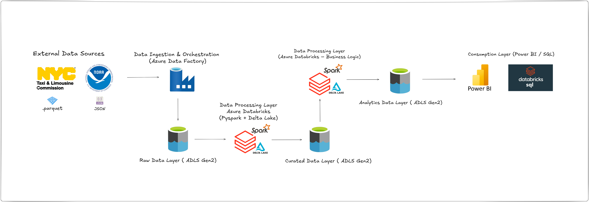
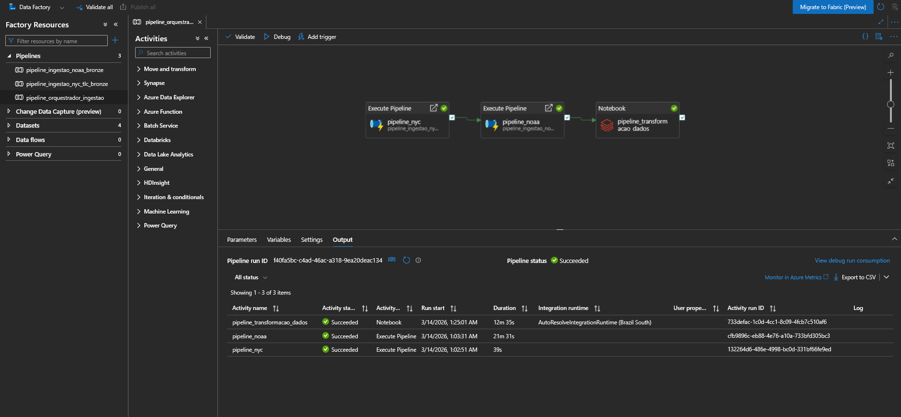
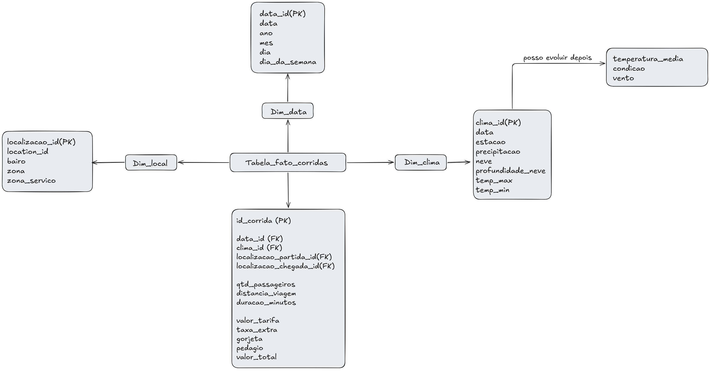

# Observatório de Mobilidade e Clima — NYC Taxi & Weather Analytics

> Pipeline de dados completo em arquitetura Lakehouse para análise da relação entre condições climáticas e demanda de corridas de táxi em Nova York.

> Status: a V1 Azure/Databricks esta preservada em [v1/](v1/). A refatoracao local esta sendo feita separadamente em [v2/](v2/README.md), comecando pela ingestion da NYC TLC 2025.

---

## Visão Geral

Este projeto constrói um pipeline de dados utilizando serviços Azure, integrando dados operacionais de corridas de táxi da NYC TLC com dados meteorológicos históricos da NOAA.

O objetivo é permitir análises como: *dias de chuva aumentam ou reduzem a demanda por táxi? Quais zonas são mais afetadas pelo clima?*

A arquitetura segue o padrão **Medallion Architecture** (Bronze → Silver → Gold), com modelo analítico dimensional (Star Schema) na camada Gold, pronto para consumo em ferramentas de BI.

---

## Arquitetura




### Tecnologias

| Tecnologia | Função |
-
| Azure Data Lake Storage Gen2 | Armazenamento em todas as camadas |
| Azure Data Factory | Orquestração e ingestão de dados |
| Azure Databricks | Processamento distribuído (PySpark) |
| Delta Lake | Formato transacional com ACID |
| Azure Key Vault | Gestão de segredos e credenciais |
| Azure Monitor + Log Analytics | Monitoramento e alertas |
| GitHub | Versionamento de código |

--

## Fontes de Dados

### NYC Taxi & Limousine Commission (TLC)

Dataset público com corridas de táxi amarelo de Nova York em 2024.

- Formato: `.parquet`
- Volume: ~41 milhões de registros brutos → ~40,4 milhões após tratamento
- Campos principais: horário de partida/chegada, zonas de embarque/desembarque, distância, valor da corrida, tipo de pagamento

### NOAA — National Oceanic and Atmospheric Administration

Dados meteorológicos históricos obtidos via API REST.

- Formato: `.json`
- Dataset: `GHCND` (Global Historical Climatology Network Daily)
- Localização: `CITY:US360019` (Nova York)
- Variáveis: temperatura máxima, temperatura mínima, precipitação, neve
- Período: 2024

**Sobre a cobertura dos dados climáticos:**

A API da NOAA possui um limite de 1.000 registros por chamada. A região de Nova York concentra 
dezenas de estações meteorológicas ativas, o que faz com que uma única chamada mensal atinja esse limite antes de cobrir todos os dias do mês.

Para minimizar esse impacto, o pipeline foi estruturado com um `ForEach` no ADF iterando mês a mês
em vez de uma única chamada anual. Ainda assim, o limite de registros por chamada resultou em cobertura parcial do calendário (~38 dias distribuídos ao longo do ano). 
Os dados climáticos disponíveis são suficientes para análises de correlação entre clima e demanda de corridas.

A solução completa para esse cenário seria a implementação de paginação via parâmetro `offset` na URL da API,
realizando múltiplas chamadas por mês até esgotar todos os registros disponíveis.

---

## Pipeline Azure Data Factory 


O pipeline orquestrador executa em sequência:

```
pipeline_nyc  ──►  pipeline_noaa  ──►  pipeline_transformacao_dados
```

> A execução sequencial foi adotada após identificar um `ConcurrentAppendException` no Delta Lake causado pela escrita simultânea dos dois pipelines quando rodavam em paralelo.

### pipeline_ingestao_nyc_tlc_bronze
Ingere arquivos `.parquet` da NYC TLC para a camada Bronze no ADLS Gen2.

### pipeline_ingestao_noaa_bronze
ForEach iterando pelos 12 meses de 2024. Chama a API da NOAA com `startdate` e `enddate` dinâmicos por mês e salva os resultados em `.json` na Bronze.

Parâmetros do pipeline:
- `ano`: `2024`
- `meses`: `["01","02","03","04","05","06","07","08","09","10","11","12"]`

### pipeline_transformacao_dados
Executa o notebook do Databricks com `%run` de todas as camadas em sequência:
```python
%run ./v1/bronze/bronze_noaa_weather_2024
%run ./v1/silver/silver_nyc_tlc_yellow_2024
%run ./v1/silver/silver_noaa_weather_2024
%run ./v1/gold/clima_taxi
```

---

## Camadas do Lakehouse

### Bronze

Dados brutos armazenados conforme recebidos da fonte, sem transformações. Garante rastreabilidade e possibilidade de reprocessamento.

- NYC TLC: arquivos `.parquet` originais convertidos para Delta Lake
- NOAA: arquivos `.json` com estrutura aninhada convertidos para Delta Lake

### Silver

**NYC TLC — transformações aplicadas:**

1. Renomeação de colunas para português com nomes descritivos
2. Filtro de colunas críticas nulas (`id_vendedor`, `data_hora_partida`, `data_hora_chegada`, `ID_local_partida`, `ID_local_chegada`, `valor_total`)
3. Remoção de valores impossíveis (distâncias negativas, chegada antes da partida, tarifas negativas)
4. Tratamento de nulos em colunas numéricas (substituição por 0)
5. Padronização de colunas categóricas (nulos substituídos por `"DESCONHECIDO"`)
6. Remoção de duplicatas por chave composta de negócio
7. Auditoria por etapa registrando quantos registros foram removidos em cada passo

**Evolução do pipeline Silver:**

Durante o desenvolvimento, o uso de `dropna()` genérico removia dados excessivamente. Após refatoração com validações por coluna:

| Etapa | Registros | Removidos |
|---|---|---|
| Bronze | ~41 milhões | — |
| Após colunas críticas | ~40,5 milhões | ~500k |
| Após valores inválidos | ~40,4 milhões | ~100k |
| Após duplicatas | ~40,4 milhões | residual |

**NOAA — transformações aplicadas:**
- Explode da estrutura JSON aninhada (`results`)
- Renomeação dos códigos de tipo de dado (TMAX → temp_max, PRCP → precipitacao, SNOW → neve, etc.)
- Remoção de nulos e duplicatas por `(data, estacao, tipo_dado)`

### Gold — Modelo Dimensional (Star Schema)



#### dim_data

| Campo | Tipo | Descrição |
|---|---|---|
| data_id | int (PK) | Chave surrogate |
| data | date | Data da corrida |
| ano | int | Ano |
| mes | int | Mês |
| dia | int | Dia |
| dia_semana | int | Dia da semana (1=Dom) |

Total: **366 registros** (2024 é ano bissexto)

> O filtro `year == 2024` foi aplicado explicitamente na criação da dimensão após identificar registros com datas inválidas de anos anteriores (2002, 2008, 2009) que passaram pelo pipeline Silver.

#### dim_localizacao

| Campo | Tipo | Descrição |
|---|---|---|
| localizacao_id | int (PK) | Chave surrogate |
| bairro | string | Bairro de NYC (Manhattan, Queens, Bronx, Brooklyn, Staten Island, EWR) |
| zona | string | Nome da zona de táxi |
| zona_servico | string | Tipo de serviço (Yellow Zone, Boro Zone, EWR) |

Total: **263 zonas** — enriquecida com NYC Taxi Zone lookup table

> Zonas 264 (Unknown) e 265 (Outside of NYC) foram removidas por não aparecerem nas corridas do dataset.

#### dim_clima

| Campo | Tipo | Descrição |
|---|---|---|
| clima_id | int (PK) | Chave surrogate |
| data | date | Data da medição |
| precipitacao | double | Precipitação (mm) |
| temp_max | double | Temperatura máxima (°C) |
| temp_min | double | Temperatura mínima (°C) |
| neve | double | Neve (mm) |

Total: **38 registros** (~3 dias por mês, limitação da API NOAA)

> Os dados climáticos foram agregados por data usando `avg()` de todas as estações disponíveis, garantindo 1 registro por dia. Os valores da NOAA são fornecidos em décimos de unidade (ex: `130` = `13.0°C`), portanto não foi necessária divisão adicional após a agregação.

#### fact_trips

| Campo | Tipo | Descrição |
|---|---|---|
| data_id | int (FK) | Referência à dim_data |
| localizacao_partida_id | int (FK) | Referência à dim_localizacao (zona de origem) |
| localizacao_chegada_id | int (FK) | Referência à dim_localizacao (zona de destino) |
| clima_id | int (FK) | Referência à dim_clima — null para dias sem dado climático |
| distancia_viagem | double | Distância em milhas |
| valor_total | double | Valor total pago |

Total: **~40,4 milhões de registros**

> A `dim_localizacao` é uma **Role-Playing Dimension** — a mesma tabela conectada duas vezes na fato com papéis diferentes (partida e chegada).

---

## Decisões Técnicas e Problemas Encontrados

### Problema 1 — Explosão de linhas na fact_trips (63 milhões de registros)

**Causa:** A `dim_clima` possuía múltiplas estações por data. O join por `data` gerou produto cartesiano parcial:
```
100 corridas no dia × 10 estações = 1.000 linhas
```

**Solução:** Agregação por data com `avg()` de todas as estações, garantindo 1 linha por dia:
```python
df_dim_clima = df_pivot.groupBy("data").agg(
    avg("precipitacao").alias("precipitacao"),
    avg("temp_max").alias("temp_max"),
    avg("temp_min").alias("temp_min"),
    avg("neve").alias("neve")
)
```

### Problema 2 — dim_clima com cobertura parcial (38 dias)

**Causa:** Ingestão configurada inicialmente com `enddate: 2024-01-31` (só janeiro). Após correção para ForEach mês a mês, a API NOAA ainda retornou apenas ~3 dias por mês devido ao limite de 1.000 registros por chamada — a região de Nova York tem dezenas de estações × 5 tipos de dado × 30 dias, estourando o limite antes de cobrir o mês inteiro.

**Solução parcial:** ForEach no ADF iterando pelos 12 meses com datas dinâmicas, aumentando a cobertura de 4 dias (janeiro apenas) para 38 dias distribuídos ao longo do ano:
```
startdate: @{concat(pipeline().parameters.ano, '-', item(), '-01')}
enddate:   @{concat(pipeline().parameters.ano, '-', item(), '-{ultimo_dia}')}
```

**Solução completa pendente:** implementar paginação com `offset` na URL da API, realizando múltiplas chamadas por mês até esgotar todos os registros disponíveis.

### Problema 3 — Datas inválidas na dim_data (anos 2002, 2008, 2009...)

**Causa:** Registros com `data_hora_partida` de anos anteriores passaram pelo pipeline Silver sem filtro de ano.

**Solução:** Filtro explícito de ano na criação da `dim_data`:
```python
df_data = (
    df_taxi
    .withColumn("data", to_date("data_hora_partida"))
    .filter(year("data") == 2024)
    .select("data")
    .distinct()
)
```

### Problema 4 — Valores climáticos em escala incorreta

**Causa:** Dados da NOAA são fornecidos em décimos de unidade (`130` = `13.0°C`).

**Solução:** Os valores foram corrigidos durante a agregação com `spark_round()`, resultando em temperaturas legíveis (ex: `33.7°C` em agosto, `-4.05°C` em dezembro).

### Problema 5 — ConcurrentAppendException no Delta Lake

**Causa:** `pipeline_nyc` e `pipeline_noaa` rodando em paralelo tentaram escrever na mesma tabela Delta simultaneamente.

**Solução:** Execução sequencial no orquestrador:
```
pipeline_nyc ──► pipeline_noaa ──► pipeline_transformacao_dados
```

---

## Governança e Segurança

**Azure Key Vault:** todos os segredos (tokens de API, connection strings) armazenados no Key Vault, nunca expostos no código.

**Managed Identity (UAMI):** configurada para acesso seguro do Databricks ao ADLS Gen2 sem uso de chaves diretas.

Permissões:
- Usuário: `Owner` + `Key Vault Secrets Officer`
- UAMI: `Key Vault Secrets User` + `Storage Blob Data Contributor`

**Secret Scope no Databricks:** a tentativa de criar Secret Scope no Databricks para integração com o Key Vault falhou devido à limitação do plano trial de 30 dias. A `account_key` foi utilizada diretamente no `config_adls.py` apenas para fins de desenvolvimento. Em produção, o Secret Scope estaria configurado e nenhuma credencial ficaria exposta no código.

**Unity Catalog:** a configuração do Unity Catalog para governança por catálogo/esquema/tabela não foi possível devido à limitação do plano trial do Databricks. Em produção, essa camada de governança permitiria controle granular de permissões por tabela e rastreabilidade de lineage. A compreensão dos conceitos de RBAC e catálogo centralizado foi aplicada na arquitetura de segurança com Key Vault e Managed Identity.

---

## Monitoramento

| Recurso | Nome |
|---|---|
| Log Analytics Workspace | `log-pipeline-lakehouse` |
| Diagnostic Settings ADF | `diag-adf-pipeline` |
| Alert Rule | `alert-pipeline-falha` |

Categorias monitoradas: `PipelineRuns`, `ActivityRuns`, `TriggerRuns`

Alerta configurado: `Failed pipeline runs > 0` → e-mail automático em até 5 minutos via action group.

```kql
ADFPipelineRun
| where Status == "Failed"
| order by TimeGenerated desc
```

Fluxo de alerta:
```
ADF executa pipeline → Falha detectada → Monitor avalia (5 min) → E-mail enviado
```

### Validação do monitoramento

O monitoramento foi validado em ambiente real:

- Pipeline executado via **Trigger** (não apenas Debug)
- Falha de pipeline detectada automaticamente pelo Azure Monitor
- **Alerta disparado por e-mail** em menos de 5 minutos após a falha
- **Log Analytics** registrando todos os PipelineRuns e TriggerRuns em tempo real
- Histórico completo de execuções (Succeeded e Failed) disponível para consulta via KQL

Essa validação comprova que o monitoramento está operacional e não apenas configurado.

> **Limitação:** o plano trial do Azure Databricks não disponibiliza Diagnostic Settings, impossibilitando integração direta dos logs do Databricks com o Log Analytics. Em produção essa integração estaria disponível.

---

## Estrutura do Repositório

```
nyc-taxi-lakehouse/
│
├── v1/                                # Versao original Azure/Databricks
│   ├── bronze/
│   ├── silver/
│   ├── gold/
│   ├── pipeline/
│   ├── data/                          # Exports CSV da Gold V1
│   ├── docs/                          # Imagens/documentacao da V1
│   └── config_adls.py
│
├── v2/                                # Refatoracao local-first
│   ├── common/                        # Caminhos e Spark local
│   ├── bronze/                        # Bronze local em andamento
│   ├── silver/                        # Proxima etapa
│   ├── gold/                          # Etapa posterior
│   └── checks/                        # Validacoes locais
│
├── .gitignore
└── README.md
```

> Os dados completos do modelo dimensional (~40 milhões de registros) estão disponíveis no Kaggle: [NYC Taxi Trips 2024 — Gold Layer (Star Schema)](https://www.kaggle.com/datasets/delzin/nyc-taxi-trips-2024-gold-layer-star-schema)

---

## Análises Possíveis

Com o modelo final é possível responder perguntas como:

- Dias de chuva ou neve reduzem a demanda por táxi?
- Quais zonas de NYC têm maior volume de corridas?
- Como a receita varia ao longo do ano?
- Qual o impacto da temperatura na distância média das corridas?
- Quais dias da semana concentram mais corridas?
- Quais são as zonas de maior receita por corrida?

---

## Evoluções Futuras

As melhorias a seguir foram identificadas durante o desenvolvimento e representam o próximo nível de maturidade do pipeline:

### Dados e modelo
- **Paginação da API NOAA com offset** — realizar múltiplas chamadas por mês para cobrir o ano inteiro, resolvendo a cobertura parcial de 38 dias
- **Adicionar colunas na fact_trips** — incluir `data_hora_partida`, `data_hora_chegada`, `duracao_minutos`, `qtd_passageiros` e `tipo_pagamento` para análises mais completas
- **Dicionário de dados** — documentar cada campo de cada tabela com tipo, descrição e regras de negócio

### Pipeline e infraestrutura
- **Pipelines incrementais** — processar apenas registros novos a cada execução, evitando reprocessamento total
- **Particionamento por data na Bronze** — organizar arquivos por `ingestion_date=YYYY-MM-DD` para melhorar performance de leitura
- **OPTIMIZE/ZORDER nas tabelas Delta** — compactar arquivos pequenos e ordenar por colunas mais usadas em filtros

### Governança e CI/CD
- **Secret Scope no Databricks** — integração com Key Vault para eliminar credenciais no código (limitação do plano trial)
- **Unity Catalog** — governança por catálogo/esquema/tabela com controle granular de permissões e lineage (limitação do plano trial)
- **GitHub Actions** — CI/CD para deploy automático dos notebooks no Databricks a cada push

---
